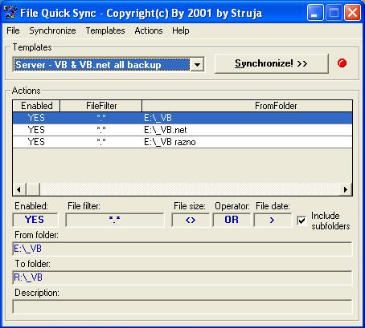



## File Quick Sync

### Description

FQS (File Quick Sync) is complete app. for synchronizing files and folders on local and network shared disks. Easy-to-use app., very functional (like Windows backup software but much user-friendly :) ). Scheduler sync included. You can create, modify, delete, import and export sync templates. I use this app. for over 9 months ... try it yourself! Post some comments if you want. Regards, Struja.

Note: you must have True DB Grid 5 control (tdbg5.ocx). You can download it from: http://web.vip.hr/struja-online.vip/tdbg5.zip
 
### More Info
 

             |
---                |---
**Submitted On**   |2002-04-19 21:30:34
**By**             |[Struja](https://github.com/Planet-Source-Code/PSCIndex/blob/master/ByAuthor/struja.md)
**Level**          |Advanced
**User Rating**    |5.0 (10 globes from 2 users)
**Compatibility**  |VB 6\.0
**Category**       |[Complete Applications](https://github.com/Planet-Source-Code/PSCIndex/blob/master/ByCategory/complete-applications__1-27.md)
**World**          |[Visual Basic](https://github.com/Planet-Source-Code/PSCIndex/blob/master/ByWorld/visual-basic.md)
**Archive File**   |[File\_Quick737104192002\.zip](https://github.com/Planet-Source-Code/struja-file-quick-sync__1-33951/archive/master.zip)

